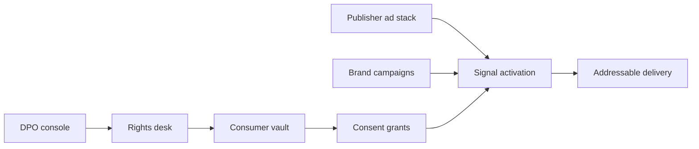

# Selfsignal

**Source:** `ai-in-decentralized+ai/presentation7faktorgdpruvtwente2017-171011113026/`
**Domain:** `ai-decentralized`
**One-liner:** A consumer-controlled identity and consent rail for behavioural advertising that lets publishers and brands operate under GDPR-grade consent while restoring addressable demand without a universal third-party ID.
**Wedge:** EU publishers and mid-market brands whose behavioural targeting collapsed under GDPR consent standards and who lack a deterministic identity spine.
**Positioning:** Faktor’s deck maps eight GDPR shocks onto advertising: one EU law, processor liability, extraterritorial reach, 4%/€20M fines, broader personal data, higher consent bar, DPOs, and five consumer rights. Selfsignal turns “power to the people” into an operable product: people hold the profile and grants; publishers and brands consume purpose-bound signals, not shadow dossiers.

## Market research synthesis

### Thesis from source

The presentation opens with the behavioural-advertising reality of fragmented offline/online profiles (mortgage intent, travel, dating, demographics) assembled without meaningful consumer control. It then enumerates eight GDPR factors that rewrite the ad economy: a single EU law; processors liable alongside controllers; non-EU companies in scope; fines up to €20M or 4% of global revenue; a broader personal-data definition; consent that must meet a higher standard; DPO obligations; and consumer rights to access, change, erasure, portability, and complaint. The effect on behavioural targeting is structural: publishers see declining ad income and need tools for sustainable models; brands lack a universal identity; consumers have no control or choice. The prescribed direction is probabilistic-vs-deterministic identity rethink plus “power to the people.” The shippable product is therefore not another CDP that warehouses profiles for brands, but a **consent-native identity vault** where the person grants purpose-limited signals to publishers and advertisers, with rights workflows built in.

### Buyer & economic model

- **Primary buyer:** Publisher Chief Revenue Officer / Ad Product lead needing GDPR-safe addressability; co-buyer Brand Data Protection / AdTech lead.
- **Users:** consumers (consent and rights), publisher ad ops, brand media teams, DPOs, consent auditors.
- **Budget owner / value metric:** publisher ad yield and brand media compliance budget. Value metric is consented addressable impression rate and rights-request cycle time.
- **Competing status quo:** cookie walls with weak consent; murky DMPs; server-side identity graphs; wholesale abandonment of behavioural targeting for contextual-only.

### Domain constraints

- **Regulatory / trust / safety:** GDPR Art. 6/7 consent standards, processor contracts, DPO reporting, cross-border transfers, children’s data, fine exposure.
- **Data sensitivity:** behavioural intent is highly sensitive; vault must minimise what brands receive (signals, not full dossiers).
- **Change-management realities:** publishers will not rip out ad servers; Selfsignal must emit tokens/segments into existing bidstreams and honour real-time opt-out.

## Business requirements

- BR-1: Consumers must create, view, edit, and erase their vault profile and see every active grant.
- BR-2: Consent grants must be purpose-bound, time-bound, and withdrawable with effect on downstream activation within a published SLA.
- BR-3: Publishers and brands must receive only the signal classes granted — never a silent full-profile dump.
- BR-4: Rights requests (access, rectification, erasure, portability, complaint) must be trackable to completion with evidence for DPO audit.
- BR-5: Processor/controller roles for each integration must be recorded so liability is contractually clear.
- BR-6: Activation must support deterministic first-party login keys and probabilistic fallbacks without inventing a hidden universal ID the consumer cannot see.
- BR-7: Fine-risk dashboards must surface consent coverage and expired grants before campaigns launch.
- BR-8: Children’s and special-category flags must hard-block behavioural activation.
- BR-9: Publishers must measure yield uplift from consented signals vs contextual baseline.
- BR-10: Brand campaigns that lack valid grants for their stated purpose must be blocked from using Selfsignal segments.
- BR-11: All consent artefacts must be exportable for regulatory inquiry.
- BR-12: Complaint cases must escalate to a human DPO queue with deadlines.

## User stories

Canonical user stories live in sibling [USER_STORIES.md](USER_STORIES.md).

## System design

### Overview

Selfsignal holds person-controlled profiles and grants. Publishers and brands register purposes and integrations. At activation time, the rail resolves whether a grant exists for that purpose and emits a minimised signal into the publisher/brand stack. Rights workflows mutate vault state and propagate erasure. DPOs operate dashboards for coverage, complaints, and processor maps.

### Actors & boundaries

- **Actors:** consumer, publisher, brand, DPO, platform operator, ad-server integrator.
- **Trust boundary:** full profile stays in the consumer vault; buyers receive purpose-bound signals. Operators cannot silently re-purpose grants.
- **Human-in-the-loop points:** complaint handling; high-risk purpose approvals; child-flag overrides (normally none).

### Core capabilities

1. **Consumer vault** — profile, preferences, visibility.
2. **Purpose-bound consent grants** — create, renew, withdraw.
3. **Signal activation** — real-time grant check and segment emission.
4. **Rights request desk** — access, change, erasure, portability, complaint.
5. **Processor/controller registry** — integration liability map.
6. **Campaign compliance gate** — block invalid purpose use.
7. **Yield & coverage analytics** — publisher/brand reporting.
8. **Audit export** — consent and rights evidence packs.

### Conceptual data

- **Primary entities:** Person, VaultProfile, Purpose, ConsentGrant, SignalEmission, RightsRequest, Integration, ComplaintCase, CoverageReport.
- **Critical events:** grant created/withdrawn, signal emitted, right fulfilled, campaign blocked, complaint opened/closed.
- **Retention / audit needs:** consent and rights history retained per GDPR accountability needs; erased personal data removed from activation paths immediately.

### Integrations (conceptual)

- **Systems of record:** CMP, ad server, DSP/SSP, CRM, DPO ticketing.
- **Upstream signals:** login/SSO, publisher first-party events, brand campaign metadata.
- **Downstream actions:** segment sync, suppression lists, erasure fan-out, regulatory exports.

### High-level architecture

### Success metrics

- **Leading:** % inventory with valid purpose grant; median rights resolution time; grant withdrawal propagation latency.
- **Lagging:** consented RPM vs contextual baseline; complaint rate; regulatory findings tied to Selfsignal evidence quality.

## OpenAPI skeleton

Canonical HTTP surface lives under `packages/openapi-core/src/` (one YAML per domain). Summarize here:

- **Base path:** `/v1/...`
- **Auth:** API key and/or Bearer JWT (operator)
- **Resource groups:** VaultProfiles, ConsentGrants, SignalActivations, RightsRequests, Integrations, ComplaintCases
