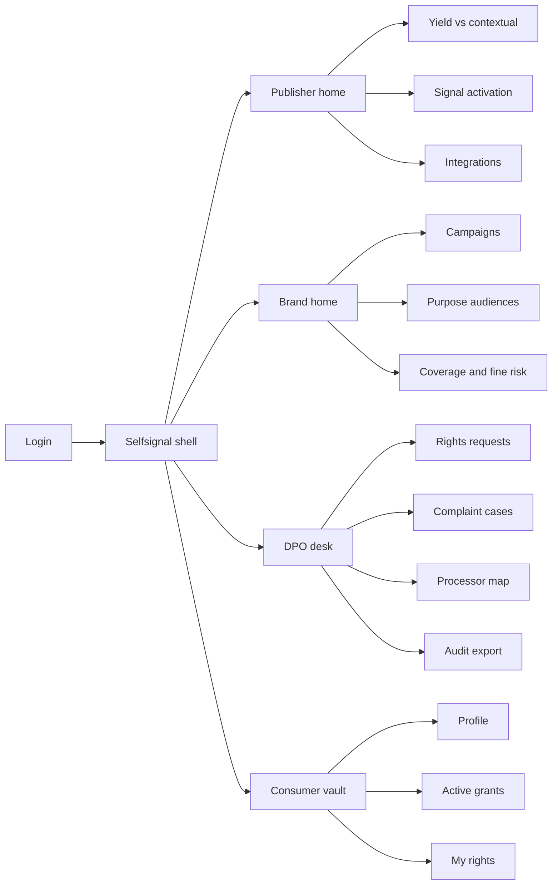
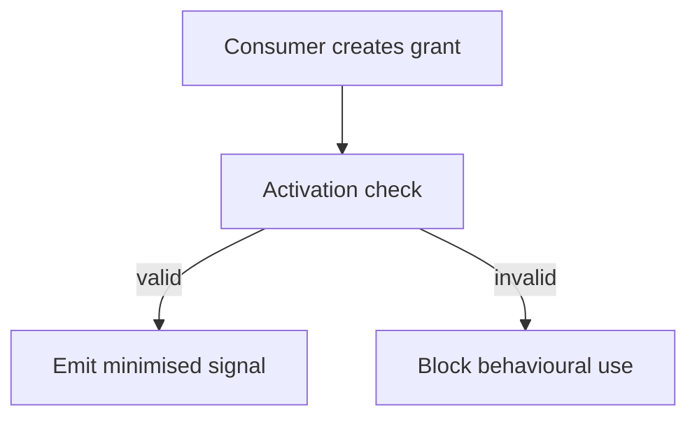
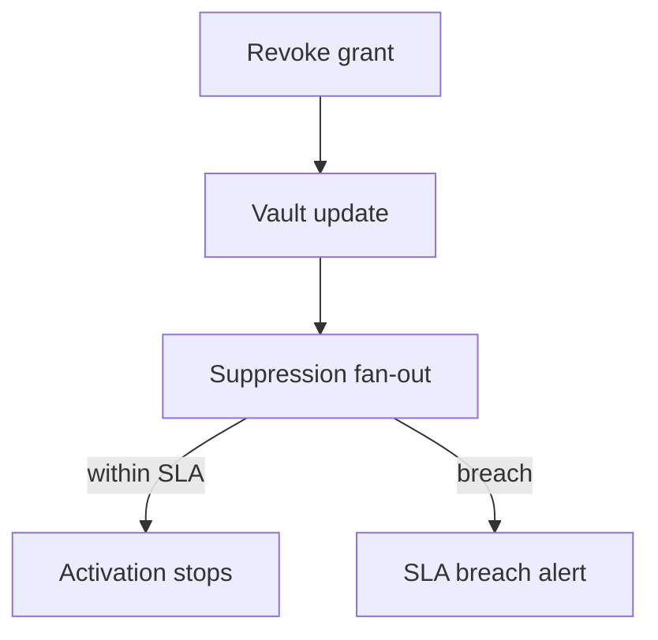

# Selfsignal — Web app

**Product:** [PRODUCT.md](./PRODUCT.md)
**Primary surface:** Dual console — Publisher / Brand operator workspace + DPO compliance desk under one Selfsignal shell
**Secondary surfaces:** Consumer vault (person-facing rights & grants); public consent-artefact attestation page (read-only regulatory export viewer)
**Design thesis:** Selfsignal is a consent rail and personal vault, not another brand CDP. The UI metaphor is a locked signal switchboard: the person holds the keys; publishers and brands only see purpose-lit lanes that are currently granted. Visual language is cool paper-white panels on deep Baltic blue-grey — bureaucratic clarity without broadsheet density — with signal-green for live grants and statute-red for blocked activation. The brand wordmark sits as a quiet seal on every rights- and money-adjacent screen so DPOs and consumers know whose accountability trail they are trusting.

## UX research synthesis

### Category peers (best-in-class)

- **Apple App Tracking Transparency / Privacy Report:** Clear per-party grant visibility and one-tap revocation. Steal: grant list as the consumer’s primary home; reject ATT’s binary OS prompt as the only publisher UX — Selfsignal needs purpose-bound, time-bound grants.
- **OneTrust / TrustArc consent & rights modules:** DPO queues, SLA clocks, evidence packs for supervisory authorities. Steal: rights desk with deadline chrome and exportable case files; reject enterprise CMP sprawl that warehouses profiles for brands.
- **LiveRamp Authenticated Traffic Solution (ATS):** First-party authenticated identity into bidstreams without inventing a consumer-invisible universal ID theatre. Steal: deterministic login keys with honest probabilistic fallback labelling; reject shadow graph aesthetics.
- **Sourcepoint / Quantcast Choice (publisher CMPs):** Publisher-side consent UX wired into ad stacks. Steal: real-time withdrawal propagation into activation; reject dark-pattern “accept all” walls as the product story.

### Patterns to adopt / reject

- **Adopt:** Consumer vault as source of truth; purpose × time grants with withdrawal SLA; minimised signal emission (never full-profile dump); processor/controller map per integration; campaign compliance gate before launch; fine-risk coverage before spend; children’s / special-category hard blocks; yield vs contextual baseline for publishers.
- **Reject:** Brand-owned CDP as the home screen; silent identity graph stitching the consumer cannot see; cookie-wall aesthetics; purple “AI audience insights”; editable consent history; complaint handling without human DPO queue.

### Trust, density, and workflow constraints from PRODUCT.md

Consumers must see and revoke every active grant (BR-1, BR-2). Buyers receive only granted signal classes (BR-3). Rights requests need SLA clocks and evidence (BR-4, BR-12). Processor roles must be recorded per integration (BR-5). Activation may use deterministic first-party keys and labelled probabilistic fallbacks — never a hidden universal ID (BR-6). Fine-risk and expired grants must block or warn before launch (BR-7, BR-10). Child/special-category flags hard-block behavioural activation (BR-8). Publishers need consented yield vs contextual (BR-9). Consent artefacts export for inquiry (BR-11). Ad servers stay; Selfsignal emits tokens into existing stacks.

## Information architecture

### Nav model

### Roles → default home

| Role | Default home | Why |
|------|--------------|-----|
| Consumer | Active grants | Revoke and see who holds purpose access (BR-1) |
| Publisher CRO / ad product | Yield vs contextual | Justify addressable recovery (BR-9) |
| Brand media manager | Campaign compliance gate | Purpose-tagged audiences only (BR-10) |
| DPO | Rights requests queue | Statutory SLA clocks (BR-4) |
| Consent auditor | Audit export | Artefacts for inquiry (BR-11) |
| Ad-server integrator | Integrations | Processor/controller roles (BR-5) |

### Cross-links to OpenAPI resources

| Nav area | OpenAPI tags / resources |
|----------|---------------------------|
| Consumer profile / vault | VaultProfiles |
| Grants create / withdraw | ConsentGrants |
| Real-time activation / segments | SignalActivations |
| Access, erasure, portability desk | RightsRequests |
| Publisher/brand processor registry | Integrations |
| Supervisory complaint files | ComplaintCases |

## Screen inventory

### Consumer vault — grants home

- **Purpose:** Show every active grant and revoke in one tap; make consent a two-way control, not a trap.
- **Entry:** Consumer login / magic link; deep link from publisher CMP handoff.
- **Layout regions:** Brand seal; profile summary (editable fields); active grants list (party, purpose, expiry); revoke affordance; rights shortcuts (access, portability, erasure).
- **Primary actions:** Revoke grant; edit profile; download data pack; open rights request.
- **Empty / loading / error:** Empty = “no brands hold a grant” with education; loading = skeleton list; error = retry with case id.
- **BR / story ties:** BR-1, BR-2; consumer stories.
- **Mobile notes:** Thumb-first revoke; grants list is the first viewport — no marketing collage.

### Publisher home — yield

- **Purpose:** Answer “is consented addressability beating contextual-only on this inventory?” 
- **Entry:** Publisher login default.
- **Layout regions:** Consented RPM vs contextual baseline; coverage % with valid purpose grant; withdrawal propagation latency; alerts (expired grants, child-flag blocks).
- **Primary actions:** Open activation health; export board pack; jump to integrations.
- **Empty / loading / error:** Empty = connect first ad-server integration.
- **BR / story ties:** BR-9; publisher revenue stories.

### Signal activation health

- **Purpose:** Real-time grant checks into the ad stack; honour opt-out within published SLA.
- **Entry:** Publisher/Brand nav → Activation.
- **Layout regions:** Emission log (minimised signal class, purpose, grant id); SLA timer for withdrawals; failure reasons (no grant, expired, special-category block); bidstream token status.
- **Primary actions:** Replay test emission; open blocked campaign; export sample for audit.
- **Empty / loading / error:** No emissions = integration not live; SLA breach = coral banner.
- **BR / story ties:** BR-2, BR-3, BR-6, BR-8.

### Brand campaign compliance gate

- **Purpose:** Block campaigns that lack valid grants for stated purpose before spend.
- **Entry:** Brand home; campaign create.
- **Layout regions:** Purpose selector; audience built only from granted signal classes; fine-risk strip (coverage, expired grants); hard-block banner when invalid.
- **Primary actions:** Launch if gated green; fix purpose; drop expired segments.
- **Empty / loading / error:** No valid grants = cannot launch; special-category = hard block with statute citation.
- **BR / story ties:** BR-7, BR-8, BR-10; brand media stories.

### Purpose audiences

- **Purpose:** Build addressable sets that are purpose-tagged and never a silent full-profile dump.
- **Entry:** Brand nav → Audiences.
- **Layout regions:** Audience list with purpose badges; membership counts from granted signals only; deterministic vs probabilistic composition labels (consumer-visible identity policy).
- **Primary actions:** Create audience; sync to DSP/ad server; refresh grant validity.
- **Empty / loading / error:** Empty = define purpose first; warn if probabilistic share exceeds policy threshold.
- **BR / story ties:** BR-3, BR-6.

### Rights request desk (DPO)

- **Purpose:** Track access, rectification, erasure, portability, complaint to completion with evidence.
- **Entry:** DPO default home.
- **Layout regions:** Queue with statutory deadline clocks; case detail with consent history; fulfilment checklist; evidence pack builder.
- **Primary actions:** Assign; fulfil; export pack; escalate to complaint case.
- **Empty / loading / error:** Empty = healthy “no open rights”; overdue = blocking red state.
- **BR / story ties:** BR-4, BR-11, BR-12.

### Complaint cases

- **Purpose:** Human DPO queue linking consent history to advertiser for supervisory response.
- **Entry:** Rights escalation; Complaints nav.
- **Layout regions:** Case file; linked grants and activations; correspondence log; deadline; authority export.
- **Primary actions:** Respond; close; attach consent artefacts.
- **Empty / loading / error:** Empty = no open complaints; missing linked grant = data-quality warning.
- **BR / story ties:** BR-12; DPO complaint story.

### Processor / controller map

- **Purpose:** Record liability roles per integration for Article 28 accountability.
- **Entry:** DPO / Integrations.
- **Layout regions:** Integration table (party, role, DPA status, purposes); drill to contract evidence; gap flags.
- **Primary actions:** Register integration; set controller/processor; attach DPA.
- **Empty / loading / error:** Unmapped live integration = blocking compliance banner.
- **BR / story ties:** BR-5.

### Fine-risk and coverage dashboard

- **Purpose:** Surface consent coverage and expired grants before campaigns launch.
- **Entry:** Brand Coverage; DPO overview.
- **Layout regions:** Coverage heatmap by purpose; expired-grant count; child/special-category block rate; projected fine-risk narrative (qualitative, not fake calculator).
- **Primary actions:** Export coverage report; open blocked campaigns.
- **Empty / loading / error:** Loading skeletons; error with request id.
- **BR / story ties:** BR-7, BR-8, BR-10.

### Audit export

- **Purpose:** Export consent and rights artefacts for regulatory inquiry.
- **Entry:** DPO Audit; secondary public attestation viewer for verified pack hashes.
- **Layout regions:** Period picker; artefact checklist; pack preview; download.
- **Primary actions:** Generate pack; verify hash; share with counsel.
- **Empty / loading / error:** Empty period = no events; generation failure = retry.
- **BR / story ties:** BR-11.

## Key flows

1. **Grant and activate** — consumer grants purpose → publisher/brand activation check → minimised signal emission; failure: no grant / expired / special-category hard block.

2. **Withdraw within SLA** — consumer revokes → vault updates → fan-out suppression → activation stops within published SLA; failure: SLA breach alerts DPO and publisher.

3. **Campaign gate** — brand sets purpose → coverage check → launch or block (BR-10).

4. **Rights fulfilment** — request opened → SLA clock → fulfil (access/erasure/portability) → evidence pack (BR-4).

5. **Complaint escalation** — rights or authority intake → human DPO case → linked consent history → response export (BR-12).

## Design system

### Tokens (CSS variables)

- `--color-ink: #1B2430` — primary text on light panels
- `--color-paper: #F7F5F2` — panel ground
- `--color-baltic-950: #0F1B28` — shell chrome / nav ground
- `--color-baltic-800: #1C2E40` — elevated chrome
- `--color-signal: #2F9E7A` — live valid grant
- `--color-signal-dim: #1B5E4A` — signal on dark
- `--color-statute: #C23B3B` — block / overdue rights
- `--color-amber: #C9892E` — expiring grant / SLA risk
- `--color-steel: #5C6B7A` — secondary labels
- `--color-brand: #3D6F8C` — Selfsignal seal (cool Baltic, not purple)
- `--font-display: "Fraunces", serif` — vault and rights titles
- `--font-body: "IBM Plex Sans", sans-serif` — console body
- `--font-mono: "IBM Plex Mono", monospace` — grant ids, purpose codes, case ids
- `--space-1`…`--space-8`: 4px scale
- `--radius-sm: 4px`; `--radius-md: 8px`
- `--motion-grant: 180ms ease-out` — grant revoke fade
- `--motion-sla: 240ms ease-in-out` — deadline pulse
- `--motion-gate: 160ms ease-out` — campaign block banner
- Atmosphere: soft paper grain on panels; deep baltic shell — calm regulatory instrument, not ad-tech neon; no cream-terracotta, no purple gradients, no broadsheet column grids.

### Typography & brand

- Fraunces for vault and DPO screen titles; Plex for tables; mono for grant and case identifiers.
- Selfsignal wordmark in shell chrome on every rights- and activation-bearing view.
- Consumer first viewport: brand + “Your grants” + revoke list — no promo tiles.

### Do / don’t

- **Do:** Purpose badges on every audience and emission; hard-block chrome for child/special-category; processor role visible on integrations; yield vs contextual as publisher primary KPI.
- **Don’t:** Brand CDP warehouse as home; hidden universal ID graphs; accept-all walls; purple AI glow; card grids of vanity privacy scores; emoji consent states.

### Accessibility & domain trust cues

- Contrast AA+ for signal/statute/amber; status includes text + icon, not colour alone.
- Live regions announce grant withdrawal and rights deadline changes.
- Focus order on consumer mobile: grants → revoke → rights.
- Audit packs include machine-readable consent history for counsel.

## Component patterns

- **GrantRow** — party, purpose, expiry, revoke; live/expired/withdrawn states.
- **PurposeBadge** — purpose-bound label on audiences and emissions.
- **ActivationGateBanner** — blocks campaign without valid grants.
- **SlaDeadlineChip** — rights/complaint countdown; statute-red when overdue.
- **MinimisedSignalChip** — shows signal class emitted, never full profile.
- **ProcessorRoleMap** — controller/processor per integration.
- **YieldVsContextual** — publisher comparison strip.
- **SpecialCategorySeal** — hard-block behavioural activation.
- **RightsEvidencePack** — export for DPO / authority.

## Out of scope for v1 web

- Full CMP replacement for every publisher property; DSP trading desk; native mobile SDK console beyond vault; children’s social network features; US-state privacy packs beyond GDPR-shaped rights desk; agency white-label portals; consumer social feed.
